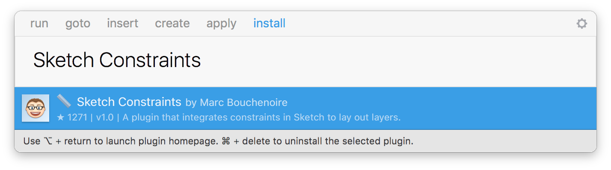
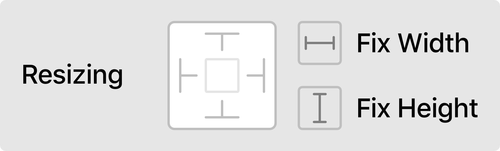

# 📏 Sketch Constraints

Sketch Constraints is a plugin that integrates constraints in Sketch to lay out layers. These constraints are relative to the parent, either a group or an artboard.

[Constraints are now available natively in Sketch. 🎉](#native)

## Usage

### Edit Constraints `⌘ + E`

### Update Layout `⌘ + L`

### Example

[👀 Watch on Vimeo](https://vimeo.com/140962822)

## Installation

### Using Sketch Runner

With Sketch Runner, just go to the `install` command and search for `Sketch Constraints`. Runner allows you to manage plugins and do much more to speed up your workflow in Sketch. [Download Runner here](http://www.sketchrunner.com).

### Manually

Make sure you have the latest version of Sketch installed. **(Sketch 40+)**

1. [Download the ZIP file of this repository](https://github.com/bouchenoiremarc/Sketch-Constraints/archive/master.zip)
2. Double click on `Sketch Constraints.sketchplugin`

## Notes

* **Constraints are not relative to other layers, only to the parent.**
* `Update Layout` updates every artboard of the current page.
* When a group is resized, all the children layers are resized. If you want a child layer to keep its size, check `Width` and/or `Height`.

## Inspiration

* This [Medium article](https://medium.com/bridge-collection/modern-design-tools-adaptive-layouts-e236070856e3) from [Josh Puckett](https://twitter.com/joshpuckett).
* [Bind](https://github.com/almonk/Bind) from [Alasdair Monk](https://twitter.com/almonk).
* [Sketch Flex Layout](https://github.com/hrescak/Sketch-Flex-Layout) from [Matej Hrescak](https://twitter.com/mhrescak).

## Native

As of [Version 44](https://sketchapp.com/updates/#version-44), constraints are available natively in Sketch. 🎉 It's similar to Sketch Constraints except that the constraints are based on current value **only**.

## License

Sketch Constraints is released under the MIT license. See [LICENSE](LICENSE) for details.
